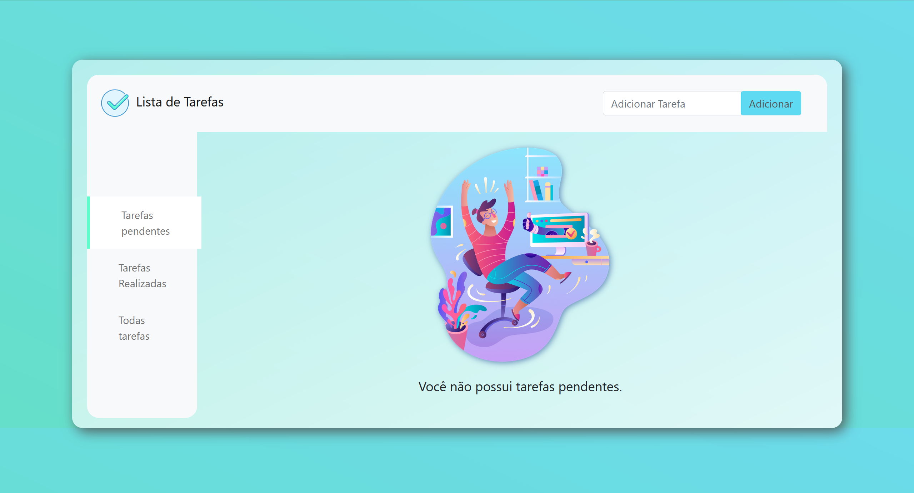
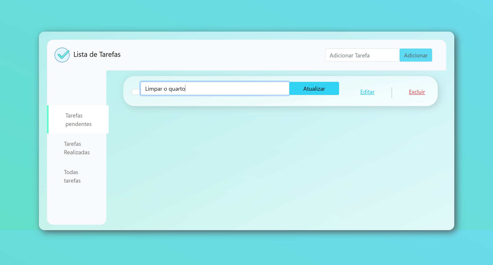
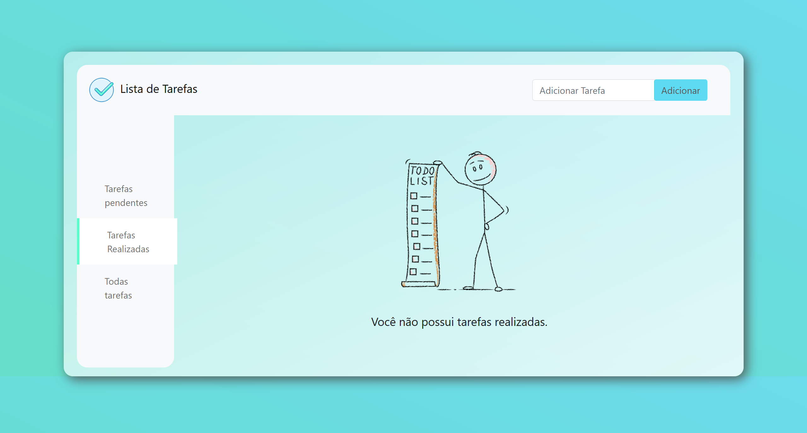
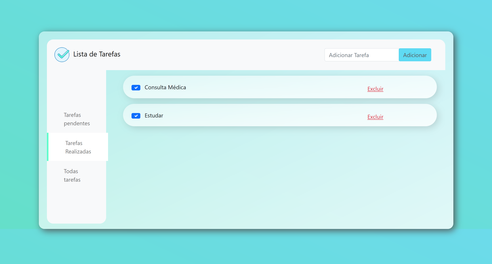
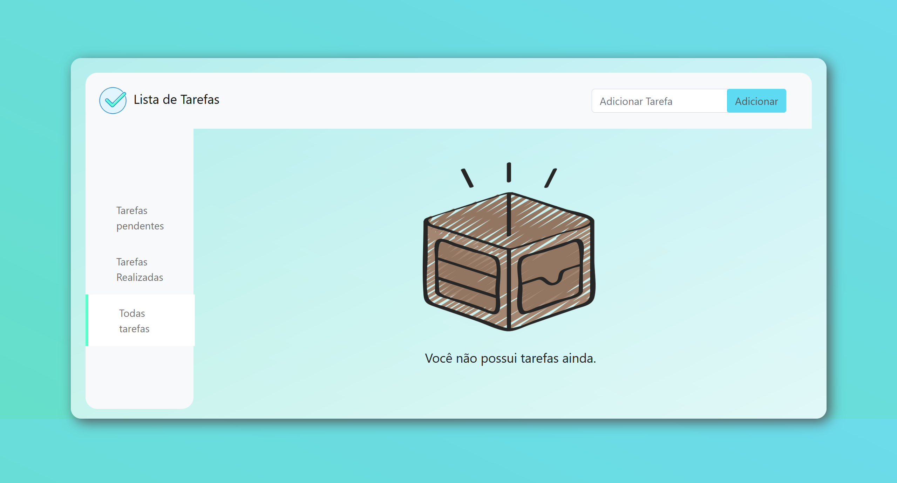
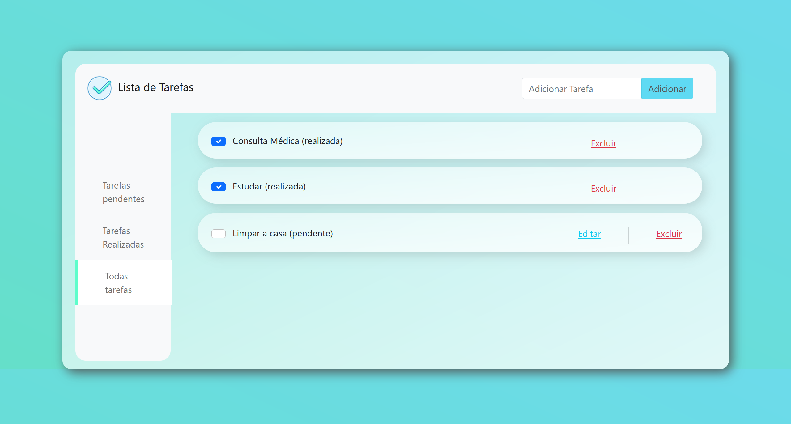

# Task Manager Web :heavy_check_mark:

Aplicação web para gerenciamento de tarefas (To-Do List), desenvolvida como projeto final da disciplina **Desenvolvimento Web**, do 2º período do curso de **Análise e Desenvolvimento de Sistemas**. 

Permite que o usuário **cadastre, visualize, edite e exclua tarefas** de forma prática.

## 🚀 Tecnologias Utilizadas

- **Front-end:** HTML, CSS (Bootstrap)
- **Back-end:** PHP, Javascript
- **Banco de Dados:** MySQL

## 🎯 Funcionalidades

- Adicionar tarefas
- Atualizar tarefas
- Marcar tarefas como concluídas
- Deletar tarefas

## ▶️ Como Rodar o Projeto (Windows)

1. **Instale o XAMPP:**
[https://www.apachefriends.org/pt_br/download.html](https://www.apachefriends.org/pt_br/download.html)

	- **Durante a instalação, Habilite os seguintes componentes:** 
		- Apache
 		- MySQL
  		- phpMyAdmin 

2. **Clone o repositório dentro da pasta do XAMPP:**
```bash
   cd C:\xampp\htdocs\
   git clone https://github.com/manoel-alves/Task_Manager-Web
```

3. **Inicie o XAMPP e ative o Apache e o MySQL.**

4. **Configure o Banco de Dados:**
	- Acesse: http://localhost/phpmyadmin
 	- Crie um banco de dados de acordo com o arquivo 'Task_Manager_db.sql'

6. **Acesse a aplicação:**
```
http://localhost/task-manager-web/Client/
```

## 📸 Screenshots
### ✅ Tela Principal

#### Tasks Adicionadas

#### Atualizando Tarefa


### ✅ *Seção*: Tarefas Completas 
#### Vazia

#### Com tarefas Completas


### ✅ *Seção*: Todas Tarefas
#### Vazia

#### Com tarefas

